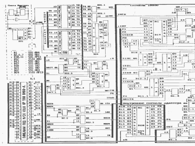

Описание установки адаптера z80 (Кишиневский вариант).
Самый продвинутый адаптер, позволяет запускать [Эмулятор ZX Spectrum 48](../zxemul).
Также информацию по данному адаптеру можно найти в [Вектор-USER](../vector_user), №14 (стр. 4), 18 (стр. 1), 19 (стр. 1), 26-27 (стр. 6), 30 (стр. 4).

