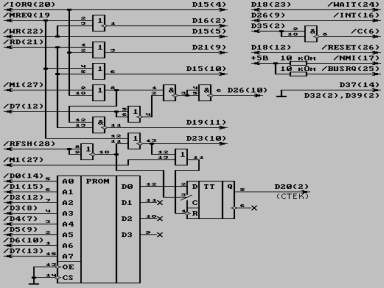

Описание установки адаптера z80 (владимирский вариант).

Схема и метод установки описан также в издании [Владимир-Вектор](../vladimir_vector). Информация по установке данного адаптера также приведена в [Вектор-USER](../vector_user): № 18 (стр. 3); 26-27 (стр. 6).

