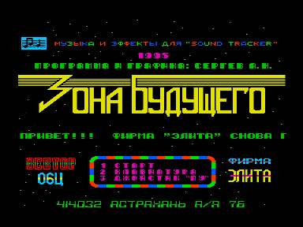
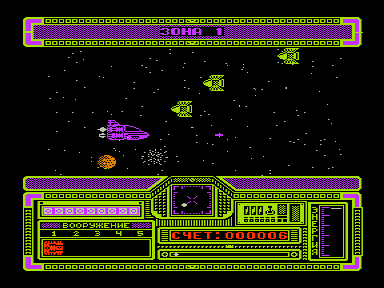

Смысл этой игры очень прост: Вам нужно всего лишь пролететь пять зон на боевом космическом шатле.
После прохождения каждой зоны Вы залетаете на промежуточную космическую базу, где Вас заправляют энергией и выдают новый вид оружия.
Оружие можно выбрать только если оно есть в окне "вооружение".
За каждые набранные 100 очков у Вас пополняется энергия на некоторую величину.

Клавиши управления: &larr;&uarr;&darr;&rarr;

Выстрел: РУС

Пауза: ПС

Выбор оружия: 1 - 5

Игру для картотеки предоставил из своего домашнего архива Syntal

7.09.2010

