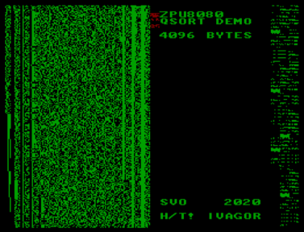

Реализация 32-битной виртуальной машины Zylin ZPU для 8080.
Она исполняет обычный код ZPU на процессоре 8080.
Скорость исполнения низкая, но код можно компилировать современным компилятором C++.

В примерах включены демо с QuickSort, порт игры Star Trek и вебсервер на основе uIP (работа uIP требует модификации эмулятора v06x, которая не входит в стандартные сборки).

