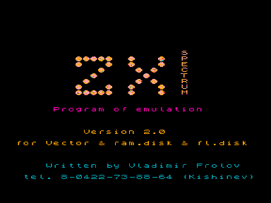
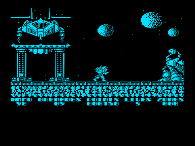

# Эмулятор ZX Spectrum 48

Программа эмулирует работу ZX Spectrum 48-совместимых компьютеров на «Векторе-06Ц».
Автор - [Владимир Фролов](../../authors/frolov), Кишинёв, 1994.

Для работы обязателен [адаптер процессора Z80 (Кишинёв)](../z80kish).
Полнофункциональной версии нужны также квазидиск и дисковод.

## Состав

| Файл | Описание |
|---|---|
| `zx320.com` | Оригинальная программа, версия 2.0 |
| `zx321.com` | То же, что `zx320.com`, но для менее качественного дисковода |
| `zx320p4.rom` | Модифицированный вариант ([Иван Городецкий](../../authors/ivagor), 2011) |
| `original.7z` | Оригинальная документация в исходных кодировках |

## Запуск в эмуляторе

Поддержка кишинёвского адаптера Z80 есть только в эмуляторе Дмитрия Целикова, который можно найти на сайте [http://bashkiria-2m.narod.ru](http://bashkiria-2m.narod.ru) (конфигурация «Vector06c-Z80»).

Запуск эмулятора удобно производить через «Внешнее ПЗУ» (крайняя правая кнопка в эмуляторе).
После подключения нажать `F11`, удерживая `F2`, затем отпустить клавиши и нажать `F12`.

Для загрузки TAP-файлов набрать `LOAD""`, `Enter`.
Также возможна загрузка `*.scl` и `*.trd` файлов.

## Модифицированный вариант (zx320p4.rom)

Автор модификации - [Иван Городецкий](../../authors/ivagor), Уфа, 14.04.2011.

Изменения и дополнения:

1. Исправлен баг TR-DOS, который на реале замедляет работу из-за лишних перемещений головки дисковода.
   Нашёл и исправил Дмитрий Целиков.
2. Исправлен баг, приводивший к зависанию TR-DOS на запросе `scroll?` при выводе на экран каталога с большим количеством файлов.
3. Добавлена поддержка AY8910 по стандарту Sound Tracker (порты `14h` и `15h`).
4. После сжатия объём программы стал меньше 32 Кб, что позволяет запускать её через «внешнее ПЗУ» в эмуляторе Дмитрия Целикова.

Подборки ПО с поддержкой AY:

- Игры для ZX Spectrum-48 - [http://zxspectrum48.i-demo.pl/48K_AY_games.html](http://zxspectrum48.i-demo.pl/48K_AY_games.html); совместимость с zx320 хорошая.
- Демки для ZX Spectrum-48 - [http://zxspectrum48.i-demo.pl/ay48k_demos.html](http://zxspectrum48.i-demo.pl/ay48k_demos.html); совместимость с zx320 (за очень редкими исключениями) плохая.

## Документация. Версия 1.0

### Назначение

Программа ZX SPECTRUM предназначена для эмуляции работы на «Векторе» Синклер 48-совместимых компьютеров.
Данное описание не ставит своей целью описание работы SINCLER-совместимых машин, а лишь указывает на некоторые особенности её реализации на «Векторе».

В зависимости от комплектации существует три версии программы:

1. `ZX110.COM` - для «Вектора».
2. `ZX210.COM` - для «Вектора» и квазидиска.
3. `ZX310.COM` - для «Вектора», квазидиска и дисковода.

Для всех версий наличие адаптера процессора Z80 является обязательным.
При дальнейшем описании номер версии, к которой это относится, будет указан в квадратных скобках.

Версии различаются по своим возможностям.
Основное отличие [2, 3] от [1] - наличие цвета, а [3] от [1, 2] - возможность работы в TR DOS (работа с SINCLER-овскими дискетами).
Версии [2, 3] могут работать как с квазидиском 256 Кб, так и с неполным квазидиском 64 Кб.

### Запуск программы

После загрузки программы появляется заставка ZX SPECTRUM.
Запуск осуществляется нажатием любой клавиши, кроме `УС`, `СС` и `РУС/ЛАТ`.
При этом программа будет использовать 0-ю плоскость квазидиска [2, 3].

Есть возможность выбрать и любую из оставшихся трёх плоскостей квазидиска.
Для этого во время нажатия, например `ВК`, следует держать нажатыми `УС`, `СС` или обе одновременно.
Для неполного квазидиска следует использовать именно последний вариант.
Для 256-килобайтного диска выбор стороны может оказаться полезным, если 0-я сторона работает не вполне надёжно.

После нажатия происходит переход в SINCLER BASIC.

### Клавиатура

Назначение `1`-`9` и `A`-`Z` не отличается от синклеровских.
`ТАБ` используется как `CAPS SHIFT`, `ПС` - как `SYMBOL SHIFT`.
Клавиши передвижения курсора и `СТР` работают как `5`, `6`, `7`, `8`, `0` (дублируют те же клавиши «Вектора»).
В SINCLER-овских играх их удобно использовать как курсор-джойстик.

Ряд клавиш облегчает работу в SINCLER BASIC.
Они имитируют нажатие сразу двух клавиш, одна из которых `CAPS SHIFT`:

| Клавиша | Эквивалент | Действие |
|---|---|---|
| `ЗБ` | `CS`+`0` | `DELETE` |
| `F1` | `CS`+`SS` | Переключение режима ввода служебных слов |
| `F2` | `CS`+`7` | Вверх |
| `F3` | `CS`+`1` | `EDIT` |
| `F4` | `CS`+`5` | Влево |
| `F5` | `CS`+`6` | Вниз |
| `АР2` | `CS`+`8` | Вправо |

### Джойстик

Джойстик может подключаться через разъём ПУ или к специальному разъёму (последний предусмотрен только в «Векторе 06Ц-2»).
Подключение должно производиться обязательно до запуска программы.
Джойстик имитирует нажатие клавиш `0`, `5`, `6`, `7`, `9`.
В SINCLER-овских программах такой джойстик носит название «курсор-джойстик».

### Специальные режимы

Только для [2, 3].
Одновременное нажатие трёх клавиш `УС`, `СС`, `РУС/ЛАТ` переводит компьютер в специальный режим.
Переход происходит после первого обращения к клавиатуре в SINCLER-овской программе.
Если SINCLER-овская программа «зависла», этого может и не произойти.

В специальном режиме выполнение SINCLER-овской программы приостанавливается и управление переходит к сервисной программе.
В специальном режиме происходит опрос клавиатуры.
В зависимости от нажатия той или иной клавиши меняются различные параметры программы.
Выход из специального режима - после снятия одновременного нажатия `УС`, `СС`, `РУС/ЛАТ`.

Клавиша `F1` специального режима соответствует начальному состоянию программы.

### Цвет

В версии [1] цвет не предусмотрен, кроме того на нижней четверти экрана отображается посторонняя информация.
Эти недостатки характерны только для версии [1] и объясняются недостатком оперативной памяти при отсутствии квазидиска.

В версиях [2, 3] существует несколько цветовых режимов (С.Р. - специальный режим):

| Клавиша | Режим |
|---|---|
| `0` С.Р. | Чёрно-белый режим |
| `2` С.Р. | Цвет фона такой же, как и цвет рамки, цвет чернил переменный |
| `1` С.Р. | Цвет чернил такой же, как цвет рамки, цвет фона переменный |

Цвет рамки меняется клавишами `+` и `-` - увеличение и уменьшение номера цвета рамки.
Номера цветов соответствуют SINCLER-овским: 0 - чёрный, 1 - синий, 2 - красный, 3 - фиолетовый и т. д.

В момент нажатия `1` или `2` С.Р. цвет фона или чернил становится таким же, как и цвет рамки.
При нажатии же `+` и `-` цвет фона и чернил остаётся неизменным.

Выбор цветов осуществляется в зависимости от выполняемой программы и может быть изменён в любой момент времени.

### Сброс

В версиях [2, 3] клавиша `R` С.Р. соответствует SINCLER-овской кнопке `RESET`.
В версии [1] - это клавиша `СС`.
Однако при сбоях программы не всегда удаётся выйти в специальный режим.

В версиях [2, 3] предусмотрен другой сброс - нажатие `БЛК` и `СБР`.
При этом происходит переход на заставку ZX SPECTRUM из любого состояния.
Однако при этом допускается возможность порчи программы.

### Работа с магнитофоном

Загрузка с магнитофона предусмотрена во всех версиях.
В версиях [2, 3] рекомендуется предварительно перейти в цветной режим для контроля за загрузкой (выгрузкой) программы.
Прерывание загрузки (выгрузки) - клавиша `РУС/ЛАТ`.

### Работа с дисководом

В версии [3] возможна работа в среде TR DOS.
Перед входом в TR DOS следует нажать клавишу `T` С.Р. - режим работы с TR DOS.
При этом допускается искажение графики надписей в некоторых программах.
Клавиша `I` С.Р. - обратная `T` С.Р. - нормальная графика, но не работа некоторых программ в TR DOS.

Переход из BASIC осуществляется стандартно, путём набора: `T`, `F1`, `L`, `1`, `5`, `6`, `1`, `6`, `ВК` (`RANDOMIZE USR 15616`).
После загрузки программ, не использующих TR DOS, рекомендуется перейти в режим нормальной графики - `I` С.Р.

### Программная совместимость

Идёт абсолютное большинство игровых программ.
Редкое исключение составляют программы, тестирующие содержание памяти или время между прерываниями (с защитой от внесения изменений).
Часть программ не работает нормально по причине прямого обращения (не через ПЗУ) к дисководу или магнитофону.
Последнее более относится к системным программам, нежели к игровым.
Следует помнить, что частой причиной неработоспособности программ является некачественная запись программы.
Некоторые программы просто трудно запустить.

### Заключение

Некоторые недостатки программы не являются принципиальными и будут учтены в последующих версиях.
Автор будет признателен за любую информацию как по работе программы ZX SPECTRUM, так и по другим вопросам, касающимся адаптера процессора Z80.
Телефон 8-0422-73-88-64 (Кишинёв), Фролов Владимир.

## Документация. Версия 2.0

### Назначение

Программа ZX SPECTRUM предназначена для эмуляции работы SINCLER 48-совместимых компьютеров на «Векторе».
Данное описание не ставит целью описание работы SINCLER-совместимых компьютеров, а лишь указывает на некоторые особенности её реализации на «Векторе».

В зависимости от комплектации существует три версии программы:

- `ZX120.COM` - для «Вектора».
- `ZX220.COM` - для «Вектора» и квазидиска.
- `ZX320.COM` - для «Вектора», квазидиска и дисковода.
- `ZX321.COM` - то же, что и `ZX320.COM`, но для менее качественного дисковода.

Для всех версий наличие адаптера процессора Z80 является обязательным.
В двух последних версиях может использоваться как полный квазидиск 256 Кб, так и неполный 64 Кб.

Версии отличаются по возможностям.
Основное отличие `ZX320` и `ZX220` от `ZX120` - наличие цвета, а `ZX320` от других - возможность работы в TR DOS (работа с синклеровскими дискетами).
Ниже приводится описание версий `ZX320` и `ZX220`.

### Запуск программы

После загрузки появляется заставка программы.
Запуск можно осуществить нажатием клавиши `ВК`.
При этом будет использоваться нулевая плоскость квазидиска.

Есть возможность использования вместо нулевой и любой из оставшихся плоскостей, если нулевая плоскость работает не вполне надёжно.
Для этого во время нажатия `ВК` следует удерживать нажатыми `УС`, `СС` или обе одновременно.
Для неполного квазидиска следует использовать именно последний вариант.
Вся информация, до этого находившаяся на соответствующей плоскости, разумеется, теряется.

После запуска управление переходит в SINCLER BASIC.

### Клавиатура

Клавиши `0`-`9`, `A`-`Z`, пробел «Вектора» имитируют нажатие какой-либо одной клавиши на SINCLER: `ВК` = `ENTER`, `TAB` = `CS` (`CAPS SHIFT`), `ПС` = `SS` (`SYMBOL SHIFT`).

Ряд клавиш облегчает работу в SINCLER BASIC.
Они имитируют нажатие сразу двух клавиш, одна из которых `CS` или `SS`:

| Клавиша | Эквивалент | Действие |
|---|---|---|
| `ЗБ` | `CS`+`0` | `DELETE` |
| `F1` | `CS`+`SS` | Переключение режима ввода служебных слов |
| `F2` | `CS`+`7` | Вверх |
| `F3` | `CS`+`1` | `EDIT` |
| `F4` | `CS`+`5` | Влево |
| `F5` | `CS`+`6` | Вниз |
| `АР2` | `CS`+`8` | Вправо |

Клавиши `;`, `-`, `/`, `:`, `.` также имитируют нажатие двух клавиш и в SINCLER BASIC, TR DOS генерируют соответствующие им символы.
Остальные не числовые и не буквенные символы, а также прописные буквы можно получить, если во время нажатия удерживать клавишу `СС`.

Назначение клавиш направления и `СТР` можно перепрограммировать по своему усмотрению, см. ниже.

### Изменение режимов работы

Нажатие некоторых клавиш при удержании `УС`, `СС` и `РУС/ЛАТ` одновременно запускает ту или иную программу сервисного режима.
Будем такое нажатие обозначать значком `'`.
Переход к сервисной программе происходит после первого обращения к клавиатуре в основной программе.
Возвращение к основной программе осуществляется после снятия одновременного нажатия.

Нажатие `'F1` восстанавливает начальные параметры программы, которые могли быть изменены.

### Перезапуск

Перезапуск SINCLER BASIC осуществляется нажатием `'Q`.
Однако при сбоях в программе не всегда удаётся выйти в сервисный режим.

Предусмотрен другой перезапуск - одновременное нажатие `БЛК` и `СБР`.
При этом происходит выход на заставку ZX SPECTRUM из любого состояния, однако допускается возможность порчи программы.

Если программа ZX записана на квазидиск как операционная система, её можно перезапустить с помощью `ВВОД` и `БЛК`.

### Управление клавиатурой

Клавиши направления и `СТР` можно перепрограммировать по своему усмотрению, их удобно использовать в игровых программах.
После запуска программы они имитируют курсор-джойстик.
По своему усмотрению все сразу их можно перепрограммировать на SINCLER 1, SINCLER 2 и CURSOR джойстик нажатием `'C`, `'U` и `'K` соответственно.

Предусмотрена возможность и перепрограммирования этих клавиш по отдельности: нажатие `'J`, клавиши направления и любой имитируемой клавиши.

Иногда возникает необходимость постоянно держать нажатой какую-либо клавишу.
Можно запрограммировать постоянное нажатие клавиши: нажатие `'Z` и нужной клавиши.
Обратное действие: `'Z` и `[`.

### Джойстик

Джойстик подключается стандартно через ПУ или через разъём `J` в «Векторе 06Ц-2».
`'*` - включение джойстика, `'H` - выключение.
При включении джойстик находится в свободном состоянии.
После включения джойстик дублирует клавиши направления и `СТР`.

### Цвет

Существует несколько цветовых режимов:

| Клавиша | Режим |
|---|---|
| `'0` | Чёрно-белый режим |
| `'3` | Цвет фона такой же, как и цвет рамки, цвет чернил переменный |
| `'4` | Цвет чернил такой же, как цвет рамки, цвет фона переменный |

Цвет рамки меняется клавишами `'+` и `'-` - увеличение и уменьшение номера цвета рамки.
Номера цветов соответствуют SINCLER-овским: 0 - чёрный, 1 - синий, 2 - красный, 3 - фиолетовый и т. д.

В момент нажатия `'3` или `'4` цвет фона или чернил становится таким же, как и цвет рамки.
При нажатии же `+` и `-` цвет фона и чернил остаётся неизменным.

`'1` и `'2` - аналогично `'3` и `'4`, с тем отличием, что цвет фона или чернил и цвет рамки выбираются автоматически.

Выбор цветов осуществляется в зависимости от выполняемой программы и может быть изменён в любой момент времени.

### Работа с магнитофоном

Загрузка с магнитофона предусмотрена во всех версиях.
В версиях [2, 3] рекомендуется предварительно перейти в цветной режим для контроля за загрузкой (выгрузкой) программы.
Прерывание загрузки (выгрузки) - клавиша `РУС/ЛАТ`.

### Работа с дисководом

Работа с дисководом в SINCLER-совместимых компьютерах возможна только через TR DOS.
Для работы с TR DOS необходимо предварительно нажать `'Y`, при этом допускается возможность неправильного отображения некоторых символов (пробела и некоторых других).
По окончании работы с дисководом рекомендуется нажать `'F` (действие, обратное `'Y`).

Выход в TR DOS из BASIC осуществляется стандартно: `'Y`, `T`, `F1`, `L`, `1`, `5`, `6`, `1`, `6`, `ВК` (`RANDOMIZE USR 15616`).

Как правило, на синклеровской дискете содержится файл `BOOT` с программой, выводящей каталог и облегчающей запуск программ.
Запуск `BOOT`: `R`, `'`, `B`, `O`, `O`, `T`, `'`, `ВК` (`RUN "BOOT"`, `BOOT` набирается прописными буквами).

Все вышеперечисленные действия автоматически производятся нажатием `'Ч` (`'^`), которая соответствует в SINCLER кнопке `RESET TR DOS`.

`'S` соответствует кнопке MAGIC.
Она служит для записи содержимого всего ОЗУ на дискету с возможностью последующей загрузки.
Есть некоторая специфика в реализации работы: MAGIC-файлы загружаются программой `ZX320`, но не наоборот.

При плохом качестве записи дисковод пытается до десяти раз прочитать плохой сектор, после чего выдаёт сообщение о плохом секторе.
Рекомендуется открыть и закрыть «карман» дисковода и некоторое время держать нажатой `R` для повторной попытки чтения.
`I` - игнорирование ошибки, `A` - прерывание чтения.

### Программная совместимость

Идёт абсолютное большинство игровых программ.
Редкое исключение составляют программы, тестирующие содержание памяти или время между прерываниями (с защитой от внесения изменений).
Часть программ не работает нормально по причине прямого обращения (не через ПЗУ) к дисководу или магнитофону.
Последнее более относится к системным программам, нежели к игровым.
Следует помнить, что частой причиной неработоспособности программ является некачественная запись программы.
Некоторые программы просто трудно запустить.

### Заключение

Некоторые недостатки программы не являются принципиальными и будут учтены в последующих версиях.
В следующей версии планируется предусмотреть работу с принтером и музыкальным сопроцессором, клавишу помощи; позднее - эмуляция SPECTRUM 128, обращение к квазидиску как к дисководу.

Автор будет признателен за любую информацию как по работе программы ZX SPECTRUM, так и по другим вопросам, касающимся адаптера процессора Z80.
Телефон 8-0422-73-88-64 (Кишинёв), Фролов Владимир.

### Приложение. Назначение клавиш сервисного режима

Выбор функции достигается нажатием соответствующей клавиши при удержании одновременно `УС`, `СС` и `РУС/ЛАТ`.

| Клавиша | Действие |
|---|---|
| `F1` | Начальный режим |
| `+` | Увеличение номера цвета рамки |
| `-` | Уменьшение номера цвета рамки |
| `0` | Чёрно-белый режим |
| `1` | Переменный цвет чернил, постоянный цвет фона (выбирается автоматически) |
| `2` | Переменный цвет фона, постоянный цвет чернил (выбирается автоматически) |
| `3` | Переменный цвет чернил, постоянный цвет фона (выбирается по цвету рамки) |
| `4` | Переменный цвет фона, постоянный цвет чернил (выбирается по цвету рамки) |
| `J` | Перепрограммирование отдельных клавиш |
| `C` / `U` / `K` | SINCLER 1 / SINCLER 2 / CURSOR джойстик |
| `Z` | Постоянное нажатие клавиши |
| `*` / `H` | Включение / выключение джойстика |
| `F` / `Y` | Правильная графика / возможность выхода в TR DOS |
| `Q` | `RESET BASIC` |
| `^` | `RESET TR DOS` |
| `S` | Кнопка MAGIC |

## Оригинальная документация

Файлы в `original.7z`:

| Файл | Кодировка | Содержимое |
|---|---|---|
| `ZX310.DOC` | КОИ-7 (латинский транслит) | Документация версии 1.0 |
| `ZX310.RTX` | CP866, только заглавные | Документация версии 1.0 |
| `zx320.doc` | КОИ-7 (латинский транслит) | Документация версии 2.0 |
| `ZX320.RTX` | CP866, только заглавные | Документация версии 2.0 |
| `zx320p4_readme.txt` | CP1251 | Readme модификации `zx320p4.rom` |

## Скриншоты

